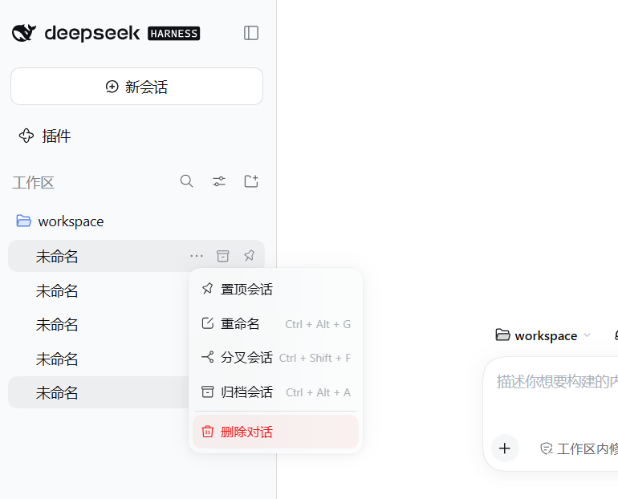
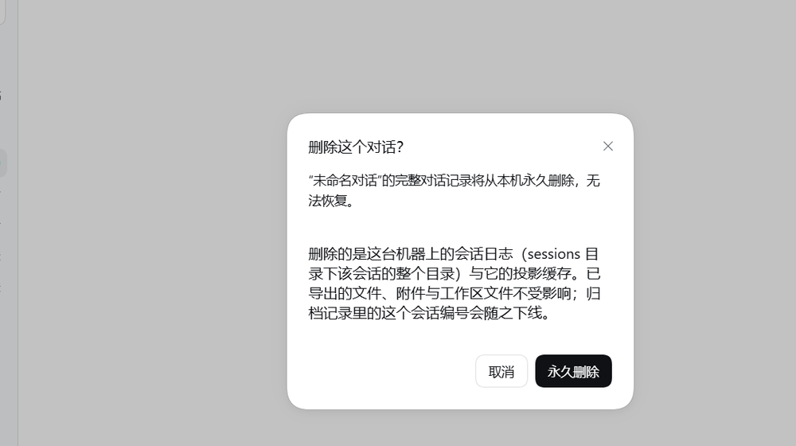
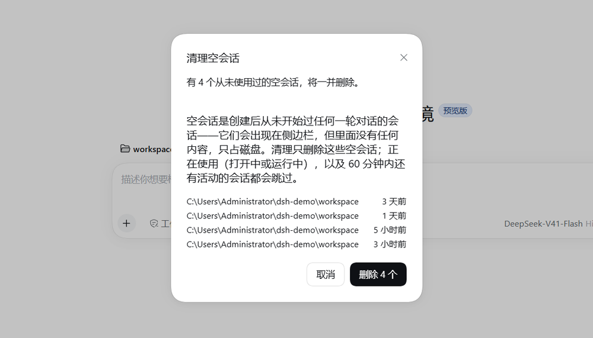

# dsh-plugin-session-delete

English | [中文](README.zh.md)


A [DSH](https://github.com/deepseek-ai/deepseek-harness) plugin: **delete a conversation**,
for real, from disk — plus bulk cleanup of empty Sessions.

DSH has no delete on purpose: archiving is the shipped non-destructive path, and its
storage backend (`SessionPersistence`) only creates, opens, flushes, stats and lists. This
plugin exists for the other case — when you want the bytes gone — and keeps every policy
decision (what may be removed, what must be refused) in the plugin rather than in a storage
layer.



> **Before you install: it deletes, and there is no undo.** One run removes the whole
> Session directory under the sessions root — **every format generation** of its log — plus
> its projection-cache record. A Session that is live in the process is refused
> (`session-live`), and the cleanup action additionally skips the open Session, anything
> running, and anything with activity inside a one-hour grace window. Attachments, exported
> files and workspace files are never touched. If you want a recoverable action, use DSH's
> archive instead.



## Install

```sh
# from GitHub — use the https form (see the note below)
dsh plugin --profile <profile> add https://github.com/SereinHK/dsh-plugin-session-delete.git

# or the packaged tarball attached to the latest release: no git needed
dsh plugin --profile <profile> add https://github.com/SereinHK/dsh-plugin-session-delete/releases/download/v0.1.2/dsh-plugin-session-delete-0.1.2.tgz
```

Or paste the same spec into the sidebar's **Plugins** page. The package carries its
own bundle patch (`dsh.bundle.patch`), so the plugin row is inserted for you — no
hand-editing of the profile's `cordis.patch.yml`. Reload the window (or the instance)
afterwards; `lib/` ships prebuilt, so nothing is compiled during install.

> **Two distribution forms, one package.** The git address is what the project itself
> uses and follows a branch; the release tarball is a frozen snapshot of the same bytes
> and needs **no `git` on the installing machine** — pnpm fetches an https URL like any
> other. Both install identically: the tarball ships `lib/`, `cordis.patch.yml` and the
> manifest that declares the bundle patch.
>
> **Not published to npm.** This repository is the distribution channel, so the registry
> form (`dsh plugin --profile <profile> add dsh-plugin-session-delete`) has nothing to
> resolve — use the `https://…` address above.
>
> **Use the `https://…` address, not the `github:owner/repo` shorthand.** pnpm
> normalizes the shorthand to an SSH URL (`git+ssh://git@github.com/…`), which fails
> on any machine without an SSH key for GitHub. Both forms select the same commit; the
> https one needs nothing but the public repo.
>
> **What gets pinned, and what does not.** The install records the dependency without a
> ref, so it follows the default branch — but pnpm's lockfile pins the exact commit it
> resolved, so re-running the install does not move it on its own. To follow a release
> deliberately, write the ref into the profile's `package.json` and re-run the install:
>
> ```json
> "dsh-plugin-session-delete": "git+https://github.com/SereinHK/dsh-plugin-session-delete.git#v0.1.0"
> ```
>
> The desktop app supplies its own package manager, so the Plugins page works without
> `pnpm` on `PATH`. A bare `dsh plugin` command needs `pnpm` available.

**Requirements:** DSH **0.2.x**. The row menu extension point this plugin registers
into (`sidebar.workspaces.session.menu.item`) does not exist in the 0.1.x line — on
that build only the sidebar cleanup action can appear. Verified against
`@deepseek-ai/dsh-desktop-runtime` 0.2.0-rc.2.

**Uninstall:** remove it from the Plugins page, or `dsh plugin --profile <profile> remove
dsh-plugin-session-delete`. From a source checkout, `node install.mjs --uninstall`.

## Summary

- `sidebar.workspaces.session.menu.item` — a red **“Delete conversation”** row in
  every Session's `...` menu, after the shipped pin/rename/fork/archive rows.
- `sidebar.footer.action` — **“Clean up empty conversations”** beside Settings:
  removes blank Sessions (`blank: true`, i.e. never started a turn) in one run.
- `shell.overlay` — the two confirmations, each listing exactly what will go.
- The node half registers two routes inside Connection's
  authenticated `/api` fence: `POST /api/session.delete` for one removal, and
  `POST /api/session.unused`, which reports the durable per-Session facts (is the
  log empty, and when was it last prompted) that the page cannot derive for itself.
  Both surfaces call the first one.



Deletion is irreversible: the whole Session directory under the sessions root
(every format generation) and its projection-cache record are removed. Exported
files, attachments and workspace files are untouched.

## Use this package

A Session row's `...` menu gains:

```
Pin / Rename / Fork / Archive
─────────────────────────────
Delete conversation          ← this package, order 900, danger
```

The dialog names the conversation, states the scope, and only then offers
**Delete permanently**. After a successful removal the Host emits
`api-session/removed` (the row disappears immediately) and the browser re-pulls
the authoritative list.

Cleanup lists the blank Sessions it found — workspace path and idle age — before
offering a count-labelled confirm, then runs one removal at a time and reports
`deleted / failed / skipped` when it settles.

### What is skipped, and why

| Situation | Behaviour | Reason |
|---|---|---|
| The conversation is open in a window | Host answers `409 session-live` | Its write handle would recreate the log or corrupt it |
| A blank Session has activity inside the last hour | Skipped by the client plan | “New Session” is blank too, and another window may be sitting in it |
| A blank Session's Agent is running | Skipped by the client plan | Not an abandoned draft |
| The id is not session-id shaped | Host answers `400 invalid-session-id` | The id becomes a path segment; it is validated before any path work |
| The target is not `<root>/<project>/<encoded id>` | Host answers `500 unsafe-target` | Last gate before a recursive removal |
| Attachments (`<DSH_HOME>/attachments`) | Never touched | Content-addressed and shared across Sessions, with no refcount |

### Failures

The route answers `{ ok: false, error: { code, message } }`; the dialog words the
codes it owns (`session-live`, `session-not-found`, `unsafe-target`) in the
active language and shows the Host's own diagnostic beneath it.

## How it works

`SessionPersistence` exposes `create`/`open`/`flush`/`stat`/`list` and nothing
else, `/clear` only drops the selection, and archive only hides a row — so a
plugin that deletes must own the removal. This one addresses the layout the
shipped JSONL backend writes:

```
<root>/<projectKey(header.cwd)>/<encodeSegment(sessionId)>/session[.vN].jsonl[.zstd]
<root>                                        → dshHomePath('sessions')
```

`projectKey` and `encodeSegment` are re-implemented here (the backend does not
export them) and are exercised against the real session root by the test suite. A
directory scan under the root backs them up, so a layout change degrades to
`session-not-found` rather than to a deletion somewhere else; `containmentRefusal`
then re-checks that the target is exactly one project directory below the root and
named after the encoded id.

The whole surface arrives through one route rather than Typert Remotes, because a
plugin's browser half cannot ship a generated `./remote` contribution without the
in-tree generator — `ctx.connection.fetch.register` is the supported seam for a
plugin-owned endpoint, and it inherits the Host/Origin + browser-token fence.

## Verified against

| Item | Value |
|---|---|
| Runtime | `@deepseek-ai/dsh-desktop-runtime` 0.2.0-rc.2 (cordis 4.0.4) |
| Slots | `sidebar.workspaces.session.menu.item`, `sidebar.footer.action`, `shell.overlay` |
| Host services | `connection`, `sessionPersistence`, `sessions` |
| Browser seed modules | `react`, `@deepseek-ai/dsh-client-ui-primitives` |
| Storage | JSONL session backend at `dshHomePath('sessions')`; projection cache at `dshHomePath('storages')/session_projcache` |

## Known limitations

- **A live Session cannot be deleted.** This is the deliberate half of the
  contract: switching away and deleting it afterwards is the supported path.
  A core `SessionPersistence.remove` plus a session-controller endpoint would let
  a Host stop and release the Session first; see the proposal in this workspace's
  `docs/upstream-issue-session-persistence-location.md`.
- **Deleting a parent orphans its children.** Child logs are separate
  (`parentSession` is lineage metadata); `sessionQuery.traceSession` degrades to
  the first unresolvable parent instead of failing.
- **No trash, no undo.** The removal is `rm -rf` on the Session directory. Export
  first (`/export`) when a conversation matters.
- **Version gating is deliberately absent.** A `@deepseek-ai/dsh-*` peer would be
  checked against the runtime version by app-boot, so `^0.2.0` would reject a
  running `0.2.0-rc.2`. This package codes against stable service and slot shapes
  and would rather fail loudly at use than refuse to mount.
- README.i18n.yaml is not hand-written here: their pairing tooling generates the
  section hashes (`pnpm run verify-translation-pairing --write …`).

## Development

The repository root **is** the package, so that a git install resolves its manifest.

```sh
node tools/build.mjs            # src/ -> lib/  (also: node tools/build.mjs --check)
node --test "tests/*.test.ts"   # 26 tests: host route, cleanup plan, dictionaries
node tools/verify-artifact.mjs  # 59 host-route checks against the built bytes
node tools/verify-browser.mjs   # 47 render/interaction checks, refusals included
node tools/verify-bundle.mjs    # is the package installable, and installed coherently?
node tools/verify-boot.mjs --scan   # which running instance carries the row
node tools/demo-home.mjs            # an isolated home (own DSH_HOME) with blank
                                    # Sessions, for screenshots or a safe review
node install.mjs [--profile web] [--bundle] [--register-only] [--uninstall]
```

`tools/demo-home.mjs` copies a working profile into a separate `DSH_HOME` and seeds
blank Sessions there, so the UI can be exercised (or photographed) without exposing a
real workspace. Run that home with `DSH_HOME=<dir> dsh --profile demo --port <n>`
— note that with a profile name, `dsh` takes no subcommand: `--profile <name>` *is* the
request to run it.

Requires **Node 22.6+**: the build and the suites use Node's own TypeScript stripping
rather than a toolchain. CI runs exactly the commands above on Node 24 (`.github/workflows/verify.yml`),
with no install step and no network.

`lib/` is **committed on purpose**: DSH serves prebuilt client bundles and runs no
bundler at install time, so a git install needs the built bytes in the tree. That is
the one place this package differs from the upstream monorepo convention, which
ignores `lib/` and builds in CI before publishing. **After editing `src/`, run
`node tools/build.mjs` and commit `lib/` alongside it** — a stale `lib/` is a plugin
that silently does nothing.

The build is dependency-free: Node's own `module.stripTypeScriptTypes` plus a small
assembly of the `src/client/*` graph into the exact
`window.__ModuleLoader__.load({ id, factory })` script the host serves. It accepts a
declared subset of TypeScript and fails loudly outside it (a `require()` for anything
but a platform seed module would take the whole page's boot down). Upstream would run
`pnpm run bundle` (tsdown) instead; the sources are written to their conventions.

`tools/` also carries the diagnostics this plugin was debugged with, and they are
worth keeping for the next plugin: `verify-boot.mjs --scan` (every instance on the
machine, and whether it carries the row), `force-reload.mjs` (does the Loader still
rebuild the profile tree?), `probe-reload.mjs` (do patch edits still apply?),
`verify-live.mjs` (are the served bundle bytes the installed ones?), `asar.mjs` (read
the running app's `app.asar`).

## Repository layout

```
package.json  cordis.patch.yml  LICENSE  .gitignore   # the package itself
src/          lib/            tests/                  # sources, built artifacts, suites
tools/        install.mjs     install.ps1             # build, verification, local install
docs/development.md                                   # debugging notes and pitfalls
PR.md  docs/upstream-issue-*.md  upstream/            # material for an upstream PR; unrelated to installing
```

